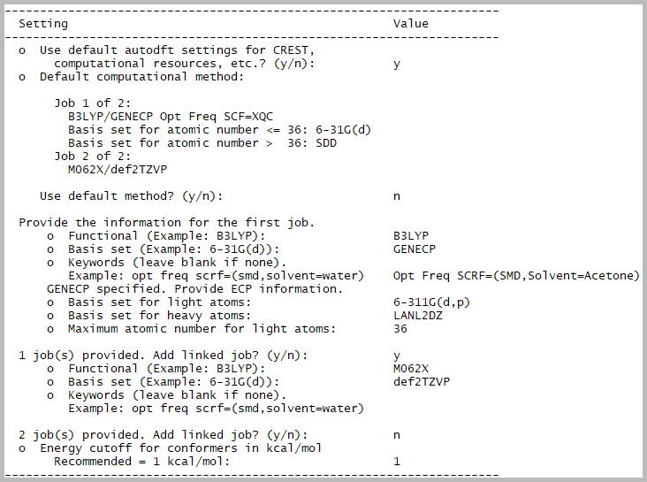
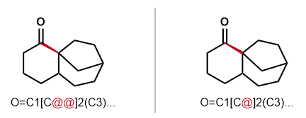
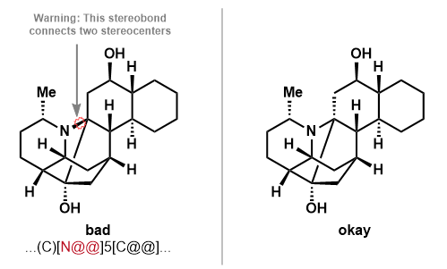

# AutoDFT
A program for automated conformer searching and DFT calculations, designed
to be user-friendly for experimentalists with no computational background.

Conformer searching is performed using CREST (Pract, P.; Bohle, F.; Grimme, S.
Phys. Chem. Chem. Phys. 2020, 22, 7169). The lowest energy conformations within
a user-specified window are then optimized with DFT using Gaussian.
Scripts are provided to check the progress of Gaussian jobs and extract key
thermodynamic data with Goodvibes (Luchini, G.; Alegre-Requena, J. V.;
Funes-Ardoiz, I.; Paton, R. S. F1000 Research, 2020, 9, 291.).

The program is designed for use on a Linux cluster with a SLURM scheduler,
and has not been tested for use with Mac. The program is not compatible with
Windows.

## Installation (first time only)
Open a terminal window: Macs can use the built-in Terminal program, and PCs
can use the built-in Windows Terminal program. Connect to the computing cluster:
- ```ssh username@garibaldi.scripps.edu```

Install the micromamba package manager if not already installed.
(Note: The more common miniconda package manager can also be used, but is
blocked by firewalls at Scripps Research)
- ```curl -Ls https://micro.mamba.pm/api/micromamba/linux-64/latest | tar -xvj bin/micromamba```
- ```./bin/micromamba shell init -s bash -p ~/micromamba```
- ```source ~/.bashrc```

Create a micromamba environment and install packages (answer yes when prompted)
- ```micromamba create -n autodft```
- ```micromamba activate autodft```
- ```micromamba install -c conda-forge pandas goodvibes rdkit=2023.09.5 cclib xtb crest pyyaml```
- ```pip install autodft```

## Basic Usage

Connect to computing cluster and activate the autodft environment if not
done already:
```
micromamba activate autodft
```

Start running AutoDFT (then answer the on-screen prompts):
```
run_autodft.py
```

Check the detailed status of Gaussian jobs:
```
gstatus.py *
```

Compile key thermodynamic data for lowest energy conformers:
```
compile_results.py *
```

### Examples of what you'll see

Sample usage of ```run_autodft.py```, showing on-screen prompts (user inputs highlighted in yellow):


Specifying custom level of theory with ```run_autodft.py```:



Sample output of ```gstatus.py```:


Sample output of ```compile_results.py``` (summary section only):


## Additional details

### AutoDFT submission
This is performed using the ```run_autodft.py``` script, which takes molecules as 
SMILES strings. Alternatively, this can be performed using ```run_autodft_xyz.py```,
which takes an .xyz files of molecules as input, which is preferred for
transition metal complexes or organic structures for which automated generation
of a 3D structure fails (e.g. bicyclo[1.1.1]pentanes)

Connect to computing cluster and activate the autodft environment if not
done already:
```
micromamba activate autodft
```

Use of ```run_autodft.py``` is simply done as shown below, followed by answering
the provided prompts:
```
run_autodft.py
```

Use of ```run_autodft_xyz.py``` is analogously done with:
```
run_autodft_xyz.py
```

### Checking job status
The script ```gstatus.py``` is provided to help check the status of Gaussian
jobs submitted by AutoDFT or manually. Specify the name of all folders to check
for .log files, separated by spaces. Wildcards can be used as part of the folder
names. If no folders are specified, the script will look in the current
directory. Note that an opt and freq job that both converge will be displayed
as 2 completed optimizations, and 2 distinct sub-jobs.

**Example:** See status of .log files in all folders (within the current one)
```
gstatus.py *
```
**Example:** See status of .log files in folders test1, test2, test3
```
gstatus.py test1 test2 test3
```
**Example:** See status of .log files in folders starting with test
```
gstatus.py test*
```
**Example:** See status of .log files in current directory
```
gstatus.py
```

### Compiling thermodynamic data
The script ```compile_results.py``` is provided to compile the key results for
all .log files in the specified directories. Specify the name of all folders to
check for .log files, separated by spaces. Wildcards can be used as part of the
folder names. If no folders are specified, the script will look in the current
directory.

Options:
- ```-a``` Use all conformations. (Default: False (use lowest only))
- ```-g``` Specify the name of the Goodvibes output file (Default: Goodvibes_output.csv)
- ```-o``` Specify the name of the summary file (Default: Goodvibes_output_summary.csv)

**Example:** Compile results from .log files in all folders (within the current one)
```
compile_results.py *
```
**Example:** Compile results from .log files in folders test1, test2, test3
```
compile_results.py test1 test2 test3
```
**Example:** Compile results from .log files in folders starting with test
```
compile_results.py test*
```
**Example:** Compile results from all .log files in current directory
```
compile_results.py
```
**Example:** Compile results from all conformers in directories starting with "test".
Save Goodvibes results to custom_filename.csv and summarized results to custom_summary_filename.csv
```
compile_results.py test* -a -g custom_filename.csv -o custom_summary_filename.csv
```

### Getting SMILES strings
Draw the molecule in ChemDraw and highlight it. In the top menu:
**Edit > Copy as > SMILES**. Or use a keyboard shortcut
(**PC: Ctrl + Alt + C, Mac: Option + Command + C**).

Charged species and radicals are both acceptable. Radicals should contain no more
than one unpaired electron.

**Limitations:** Use of SMILES strings is poorly suited for metal complexes,
carbenes/nitrenes, and hypervalent species (silicates, phosphoranes, sulfuranes,
hypervalent iodine, etc.). For these, use of ```run_autodft_xyz.py``` is preferred.

#### Points of caution

It's safer to draw the molecule in a 2-dimensional representation to help
ensure that stereochemistry is assigned properly. For fused rings, it's often
safest to draw the stereochemistry of hydrogens/substituents at the ring
junction, rather than to use endocyclic bonds.

Be especially careful about specifying stereochemistry when you have highly
bridged systems. If looking at a molecular model, make sure to view the
bond that will be drawn as wedged/dashed from head-on as opposed to from the
side:


Be careful about the directionality of wedges. Opposite directionality
corresponds to opposite stereochemistry:



In certain cases, stereochemistry may be misintepreted as being at heteroatoms,
which can ultimately lead to invalid structures. Pay attention to any ChemDraw warnings:



### Custom settings
If you would like, you can specify custom AutoDFT settings to use (including
DFT level of theory). This is recommended if you routinely preform calculations
at a different level of theory. To do this, copy/paste the below text, which
contains the default AutoDFT settings. Then, modify as desired, and save 
as a new file named ```config.yaml```. The text following the '#' symbols are
descriptive comments and do not affect the settings.

Upload your ```config.yaml``` file to the computing cluster. When running
AutoDFT in the future, you can respond ```n``` to the prompt about using the
default settings for CREST, resources, etc. Then, type ```config.yaml``` 
when prompted (make sure you are in the folder containing the ```config.yaml``` file).


```
autodft_flow:                           # Settings for 'chaperone' job
  mem: 128mb                            # Memory
  processors: 1                         # Number of processors
  time: '30:00:00'                      # Wall time (should be at least the sum of wall times for the CREST and Gaussian jobs)

crest:
  method: gfn2                          # Method (for available options, see: https://crest-lab.github.io/crest-docs/page/documentation/keywords.html)
  solvent: ''                           # Solvent (do not include --gbsa flag) (for available solvents, see: https://xtb-docs.readthedocs.io/en/latest/gbsa.html#parameterized-solvents)
  mem: 2gb                              # Memory
  nprocshared: 12                       # Number of processors
  time: '6:00:00'                       # Wall time
  rm_extra_files: true                  # Remove extra CREST files  
  keywords: ''                          # Additional keywords (see: https://crest-lab.github.io/crest-docs/page/documentation/keywords.html)

gaussian_input:
  version: '16'                         # Version of Gaussian (09 or 16)
  maxjobs: 10                           # Maximum number of jobs to submit
  mem: 2gb                              # Memory per job
  nprocshared: 12                       # Processors per job
  time: '24:00:00'                      # Wall time per job
  write_chk: false                      # Whether to write and keep .chk files. Always written if there are linked jobs, but this decides whether they are kept

gaussian_jobs:                          # Dashes indicate beginning of data for a job (can add or remove jobs as desired)
- functional: B3LYP                     # Functional (for options, see: https://gaussian.com/dft/)
  basisset: GENECP                      # Basis set (for options, see: https://gaussian.com/basissets/) (write GENECP for split basis set) 
  route: Opt Freq SCF=XQC               # Route line (for linked jobs, do not add geom=allcheck guess=read (added automatically))
  ecp_basisset_light: 6-31G(d)          # For split basis sets, the basis set for light atoms (write null if not applicable)
  ecp_basisset_heavy: SDD               # For split basis sets, the basis set for heavy atoms (write null if not applicable)
  ecp_cutoff: 36                        # For split basis sets, the maximum atomic number for light atoms (write null if not applicable)
- functional: M062X
  basisset: def2TZVP
  route: ''
  ecp_basisset_light: null
  ecp_basisset_heavy: null
  ecp_cutoff: null
  
goodvibes:
  conc: '1'                             # Concentration (mol/L; 1 mol/L is solution phase standard state)
  f_cutoff: '100'                       # Frequency cutoff (cm-1) for quasiharmonic oscillator approximation
  qs: truhlar                           # Quasiharmonic oscillator approximation method
  keywords: ''                          # Additional keywords (see: https://goodvibespy.readthedocs.io/en/latest/source/README.html#using-goodvibes)

```
